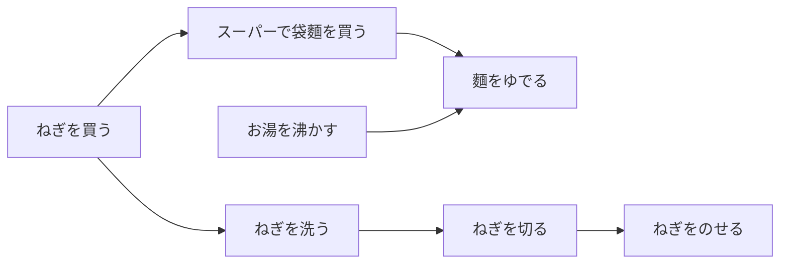

```mermaid
    flowchart LR

    id5["ねぎを買う"]
    id6["スーパーで袋麵を買う"]
    id8["お湯を沸かす"]
    id9["麵をゆでる"]
    id10["ねぎを洗う"]
    id11["ねぎを切る"]
    id12["ねぎをのせる"]

    id5-->id6
    id6-->id9
    id8-->id9
    id5-->id10
    id10-->id11-->id12
```
