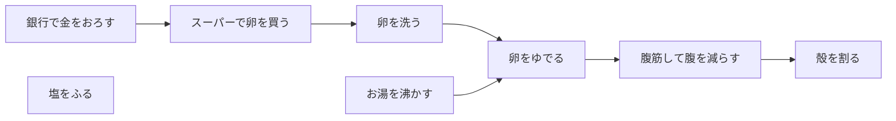

```mermaid
    flowchart LR

    id5["銀行で金をおろす"]
    id6["スーパーで卵を買う"]
    id7["卵を洗う"]
    id8["お湯を沸かす"]
    id9["卵をゆでる"]
    id10["腹筋して腹を減らす"]
    id11["殻を割る"]
    id12["塩をふる"]

    id5-->id6-->id7
    id7-->id9
    id8-->id9-->id10-->id11
    id12
```
