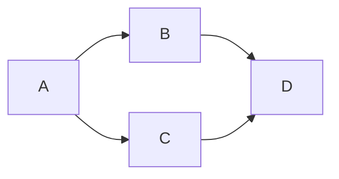
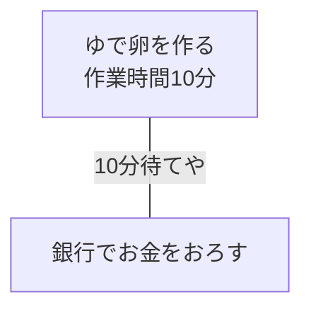
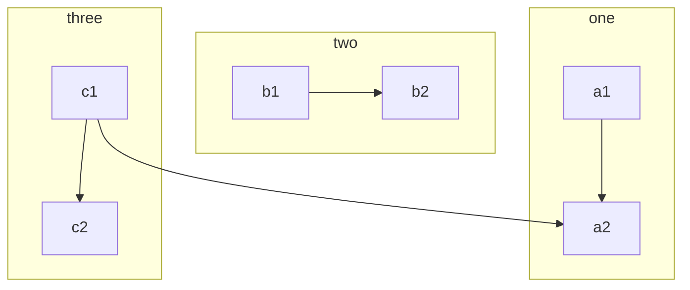

```mermaid
graph LR;
    A-->B;
    A-->C;
    B-->D;
    C-->D;
```

```mermaid
flowchart BT
    id1["銀行でお金をおろす"]
    id2["ゆで卵を作る
        作業時間10分"]
    id1--10分待てや---id2
```

```mermaid
flowchart TB
    c1-->a2
    subgraph one
    a1-->a2
    end
    subgraph two
    b1-->b2
    end
    subgraph three
    c1-->c2
    end
```

