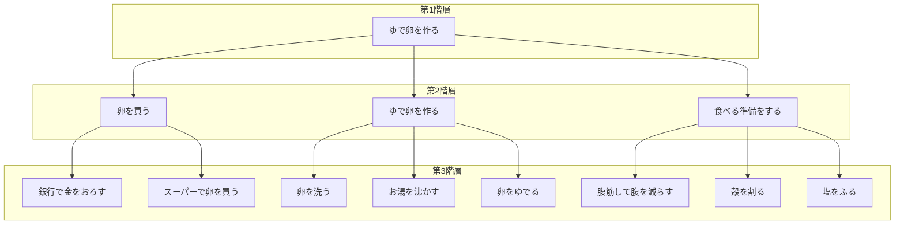

```mermaid
    
flowchart TD
    subgraph "第1階層"
    id1["ゆで卵を作る"]
    end
    
    subgraph 第2階層
    id2["卵を買う"]
    id3["ゆで卵を作る"]
    id4["食べる準備をする"]

    id1-->id2
    id1-->id3
    id1-->id4
    end

    subgraph 第3階層
    id5["銀行で金をおろす"]
    id6["スーパーで卵を買う"]
    id7["卵を洗う"]
    id8["お湯を沸かす"]
    id9["卵をゆでる"]
    id10["腹筋して腹を減らす"]
    id11["殻を割る"]
    id12["塩をふる"]

    id2-->id5
    id2-->id6

    id3-->id7
    id3-->id8
    id3-->id9

    id4-->id10
    id4-->id11
    id4-->id12

    

    end
```